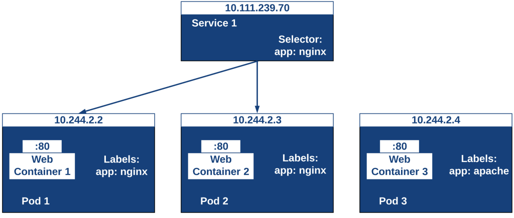

# LABELS



1. Create file pod_labels.yaml

    ```console
    nano pod_labels.yaml
    ```

    ```yaml
    kind: Pod
    apiVersion: v1
    metadata:
     name: nginx-labels
     labels:
       release: stable
       environment: dev
       tier: backend
       region: us
    spec:
     containers:
     - name: nginx
       image: nginx:alpine
    ```

2. Execute

    ```console
    kubectl apply -f pod_labels.yaml
    ```

3. Show all the labels of a pod.

    ```console
    kubectl get pods --show-labels
    ```

4. Add a new label to a Pod.

    ```console
    kubectl label pods nginx-labels "canary=true"
    kubectl get pods --show-labels
    ```

5. Update labels:

    ```console
    kubectl label pods nginx-labels canary=false status=ok --overwrite=true
    kubectl get pods --show-labels
    ```

6. Remove 'region and status' labels by editing pods.

    ```console
    kubectl edit pods nginx-labels #Abrira un vim editor, remover la linea “region: us” y “status: ok” tecleando dos veces “d” y luego ESC, finalmente :x
    kubectl get pods --show-labels
    ```

7. Show labels as columns.

    ```console
    kubectl get pods -L tier,canary,environment,region
    ```

## LABELS SELECTORS

### Conditional AND

1. Filter by release and conditional AND.

    ```console
    kubectl get pods --selector="release=stable"
    kubectl get pods --selector="release=stable,tier=backend"
    kubectl get pods --selector="release=stable,region=us" # Este ultimo no debe devolver nada porque quitamos el label region
    ```

### Conditional OR

1. Filter by release and conditional OR.

    ```console
    kubectl get pods --selector="release in (stable, staging)"
    kubectl get pods --selector="environment in (dev, prod)" -L environment
    ```

### Selector with Service

1. Create file selector_service.yaml with content:

    ```console
    nano selector_service.yaml
    ```

    ```yaml
    kind: Service
    apiVersion: v1
    metadata:
     name: nginx-selectors-svc
    spec:
     type: ClusterIP
     selector:
       tier: backend
       release: stable
     ports:
     - port: 80
    ```

2. Execute

    ```console
    kubectl apply -f selector_service.yaml
    kubectl get service
    kubectl describe service nginx-selectors-svc
    kubectl describe pod nginx-labels|grep IP
    ```

### Let's pay attention to the values of Labels, Selector, and Endpoints | Verify that the endpoint is the same IP as the nginx-labels pod

## Automatically update the Endpoint of the service

1. Add new file pod_labels2.yaml with content.

    ```console
    nano pod_labels2.yaml
    ```

    ```yaml
    kind: Pod
    apiVersion: v1
    metadata:
     name: nginx-labels2
     labels:
       release: stable
       environment: dev
       tier: backend
       region: us
    spec:
     containers:
     - name: nginx2
       image: mario21ic/nginx:alpine
    ```

2. Execute

    ```console
    kubectl apply -f pod_labels2.yaml
    kubectl describe pod nginx-labels2|grep IP
    kubectl describe service nginx-selectors-svc
    ```

### We will see that in the Service nginx-selectors-svc in Endpoints there are now two IPs, this is because through the selector, we defined that the pod labels2 would be within the Service nginx-selectors-svc

## Optional: make a query to the service

```console
minikube ssh
curl -I <ip-service>
exit
```
