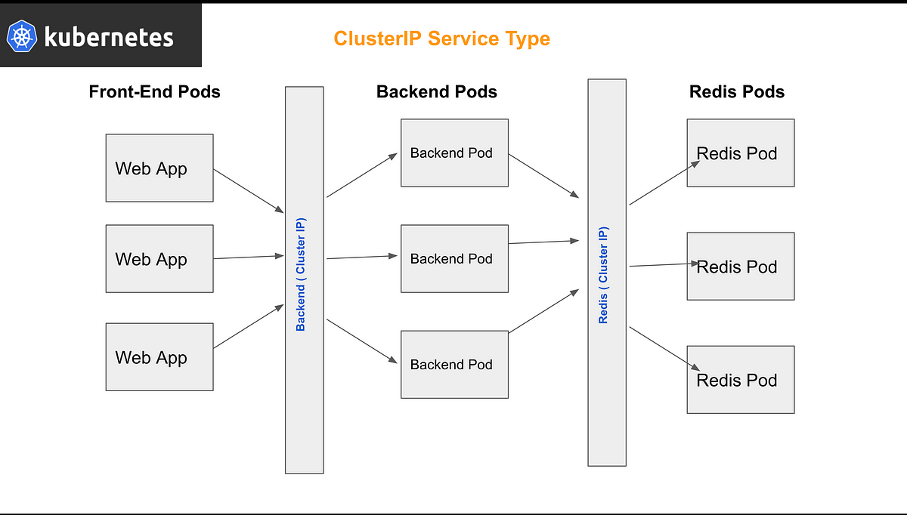
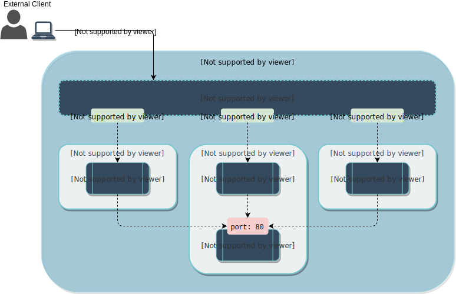
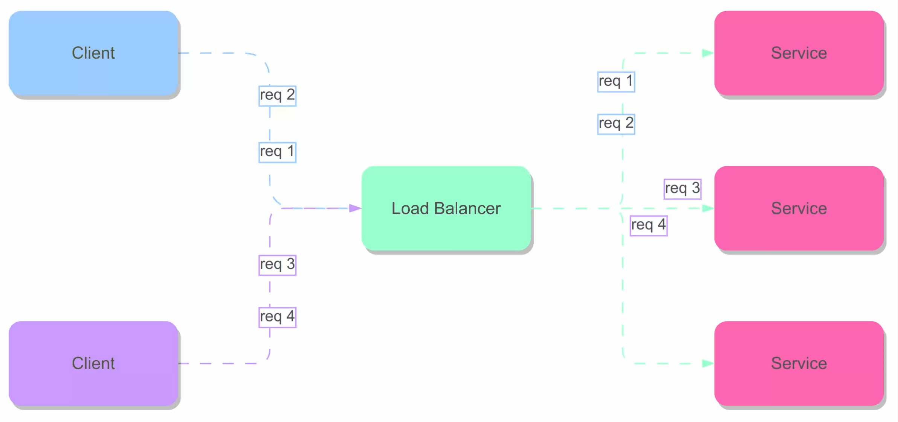

# K8s Services

- Define a logical set of pods
  - Pods are determined using labels (selector)
- Reliable, fixed IP address (Dirección IP fija y confiable)
- Automatic DNS entries
  - E.g. hello-web.default

## K8s Services types

- **ClusterIP**: service is exposed on a cluster-internal IP (default)
- **NodePort**: uses the same static port on each cluster node to expose to service.
- **LoadBalancer**: Uses cloud provider’s load balancer to expose the service.
- **ExternalName**: maps the service to a DNS name

## K8s Services | ClusterIP

- **CLUSTERIP** SERVICES IN KUBERNETES ONLY ALLOW INTERNAL COMMUNICATION AND ARE NOT ACCESSIBLE FROM OUTSIDE THE CLUSTER.



1. Create file deploy.yaml:

    ```console
    nano deploy.yaml
    ```

    ```yaml
    kind: Deployment
    apiVersion: apps/v1
    metadata:
      name: nginx-dp
    spec:
      selector:
        matchLabels:
          app: nginx
      replicas: 2
      template:
        metadata:
          labels:
            app: nginx
        spec:
          containers:
          - name: nginx
            image: nginx:alpine
            ports:
            - name: web
              containerPort: 80
              protocol: TCP
    ```

    ```console
    kubectl apply -f deploy.yaml
    kubectl get deploy,pods
    ```

2. Create file nginx_svc.yaml

    ```console
    nano nginx_svc.yaml
    ```

    ```yaml
    kind: Service
    apiVersion: v1
    metadata:
      name: nginx-cl-svc
    spec:
      type: ClusterIP
      selector:
        app: nginx
      ports:
        - port: 80
    ```

3. Create and check:

    ```console
    kubectl apply -f nginx_svc.yaml
    kubectl get svc
    kubectl describe service nginx-cl-svc #Review the Endpoints and IP
    ```

4. Validate:

    ```bash
    kubectl run -i --tty --rm debug --image=busybox --restart=Never -- wget -O- http://nginx-cl-svc:80
    ```

5. **Service Discovery**: Enter a pod and install curl to point to the service:

    ```console
    kubectl get svc
    kubectl run mysh -ti --rm --image=alpine:latest --restart=Never -- sh 
    apk add curl
    ping nginx-cl-svc
    curl -I nginx-cl-svc
    exit
    ```

6. In another terminal(s) make logs for each pod(s):

    ```console
    kubectl get pods
    kubectl logs -f nginx-dp-<pod_id>
    ```

**************************

## K8s Services | NodePort

- **NODEPORT** in Kubernetes exposes your application outside of the cluster by assigning a specific port (in this case, 32002) on all nodes. Traffic sent to this port on any node is redirected to port 80 of your pod nginx.



1. Create file service.np.yaml

    ```console
    nano service.np.yaml
    ```

    ```yaml
    kind: Service
    apiVersion: v1
    metadata:
     name: nginx-np-svc
    spec:
     type: NodePort
     selector:
       app: nginx
     ports:
       - name: web
         nodePort: 32002 # node
         port: 8080 # servicio interno
         targetPort: 80 # pod-container
    ```

2. Apply and review the type and port:

    ```console
    kubectl apply -f service.np.yaml
    kubectl get svc
    kubectl describe svc nginx-np-svc
    ```

3. Find IP and apply curl:

    ```console
    kubectl describe node | grep IP && minikube ip
    minikube service nginx-np-svc --url
    curl -I 192.168.49.2:32002
    ```

4. Optional with minikube:

    ```console
    curl -I $(minikube ip):32002
    minikube service nginx-np-svc
    curl -I $(minikube service nginx-np-svc --url)
    ```

5. Verify the internal Service port of the Nodeport:

    ```console
    kubectl run mysh -ti --rm --image=alpine:latest --restart=Never -- sh
    apk add curl
    curl -I nginx-np-svc:8080
    ping nginx-np-svc
    exit
    ```

6. Create  file service.np2.yaml

    ```console
    nano service.np2.yaml
    ```

    ```yaml
    kind: Service
    apiVersion: v1
    metadata:
     name: nginx-np2-svc
    spec:
     type: NodePort
     selector:
       app: nginx
     ports:
       - name: http
         nodePort: 32002 # node
         port: 8080 # service interno
         targetPort: 80 # pod-container
    ```

7. Apply and check:

    ```console
    kubectl apply -f service.np2.yaml # Debe salir error de port en uso.
    ```

8. To solve this, edit the file again deleting the line:
nodePort: 32002 # node | And apply again:

    ```console
    kubectl apply -f service.np2.yaml
    kubectl get svc
    curl $(minikube ip):32421 # Esta es la ip y port del node
    ```

**************************

## K8s Services | Load Balancer

-s



1. Create file service.lb.yaml

    ```console
    nano service.lb.yaml
    ```

    ```yaml
    kind: Service
    apiVersion: v1
    metadata:
     name: nginx-lb-svc
    spec:
     type: LoadBalancer
     selector:
       app: nginx
     ports:
       - name: http
         protocol: TCP
         port: 8080 # service externo
         targetPort: 80 # container
    ```

2. Execute

    ```console
    kubectl apply -f service.lb.yaml
    kubectl get svc #We see that the service is in “pending” status in the “external-ip” column.
    ```

3. We will do a simulation with minikube to give an IP.

    ```console
    minikube tunnel
    ## En otro terminal:
    kubectl get svc
    curl <external_ip>:8080
    ```

## K8s Services | External Name

1. Create file service.external.yaml

    ```console
    nano service.external.yaml
    ```

    ```yaml
    kind: Service
    apiVersion: v1
    metadata:
      name: my-database-svc
    spec:
      type: ExternalName
      externalName: app.deliverygo.app
    ```

2. Execute

    ```console
    kubectl apply -f service.external.yaml
    kubectl get svc
    ```

3. Verify that it is resolving:

    ```console
    kubectl run mysh -ti --rm --image=alpine:latest --restart=Never -- sh
    ping my-database-svc
    apk add curl
    curl -I my-database-svc
    exit
    ```

### Services with Static Ip

1. Create file service.static.yaml

    ```console
    nano service.static.yaml
    ```

    ```yaml
    kind: Service
    apiVersion: v1
    metadata:
     name: external-ip-database
    spec:
     ports:
       - port: 3306
    ---
    kind: Endpoints
    apiVersion: v1
    metadata:
     name: external-ip-database
    subsets:
     - addresses:
       - ip: 192.168.0.24
       ports:  
       - port: 3306
    ```

    ```console
    kubectl apply -f service.static.yaml
    kubectl describe svc external-ip-database #Look at endpoints
    ```

2. Clean all:

    ```console
    kubectl delete all --all
    ```
