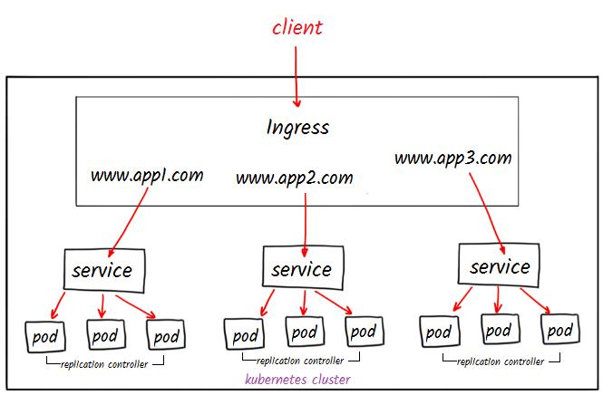

# INGRESS



1. Activate addons of ingress

    ```console
    minikube addons enable ingress
    minikube addons list | grep ingress
    ```

2. Create file web1.yaml

    ```console
    nano web1.yaml
    ```

    ```yaml
    kind: Deployment
    apiVersion: apps/v1
    metadata:
      name: web1
    spec:
      selector:
        matchLabels:
          app: web1
      replicas: 2
      template:
        metadata:
          labels:
            app: web1
        spec:
          containers:
          - name: web1
            image: nginx:alpine
            ports:
              - name: http
                containerPort: 80
                protocol: TCP
    ---
    kind: Service
    apiVersion: v1
    metadata:
      name: web1-svc
    spec:
      type: NodePort
      selector:
        app: web1
      ports:
        - port: 8080
          targetPort: 80
    ```

3. Execute

    ```console
    kubectl apply -f web1.yaml
    kubectl get pod,deploy,svc
    ```

4. Create file web2.yaml

    ```console
    nano web2.yaml
    ```

    ```yaml
    kind: Deployment
    apiVersion: apps/v1
    metadata:
     name: web2
    spec:
     selector:
       matchLabels:
         app: web2
     replicas: 2
     template:
       metadata:
         labels:
           app: web2
       spec:
         containers:
         - name: web2
           image: nginx:alpine
           ports:
             - name: http
               containerPort: 80
               protocol: TCP
    ---
    kind: Service
    apiVersion: v1
    metadata:
     name: web2-svc
    spec:
     type: NodePort
     selector:
       app: web2
     ports:
       - port: 8080
         targetPort: 80
    ```

5. Execute

    ```console
    kubectl apply -f web2.yaml
    kubectl get pod,deploy,svc
    ```

6. Test NodePorts:

    ```console
    kubectl get svc
    curl $(minikube ip):31210 # Debe salir la v1
    curl $(minikube ip):31512 # Debe salir la v2
    ```

7. Create file ingress.yaml

    ```console
    nano ingress.yaml
    ```

    ```yaml
    apiVersion: networking.k8s.io/v1
    kind: Ingress
    metadata:
      name: web-ingress
      annotations:
        nginx.ingress.kubernetes.io/rewrite-target: /$1
    spec:
      rules:
      - host: hello-world.info
        http:
          paths:
          - path: /
            pathType: Prefix
            backend:
              service:
                name: web1-svc
                port:
                  number: 8080
          - path: /v2/*
            pathType: Prefix
            backend:
              service:
                name: web2-svc
                port:
                  number: 8080
    ```

8. Execute:

    ```console
    kubectl apply -f ingress.yaml
    kubectl get ingress
    ```

9. Tests ingress:

    ```console
    curl -H "Host: hello-world.info" $(minikube ip)
    curl -H "Host: hello-world.info" $(minikube ip)/v2
    ```

10. Simulating Domain hello-world.info

    ```console
    minikube ip
    sudo vim /etc/hosts
    ```

11. We add the minikube IP at the end:

    ```vim
    192.168.49.2 hello-world.info
    ```

    ```console
    ping hello-world.info
    curl hello-world.info
    curl hello-world.info/v2
    curl hello-world.info/v2/xD
    ```

12. Delete all:

    ```console
    kubectl delete all --all
    ```
