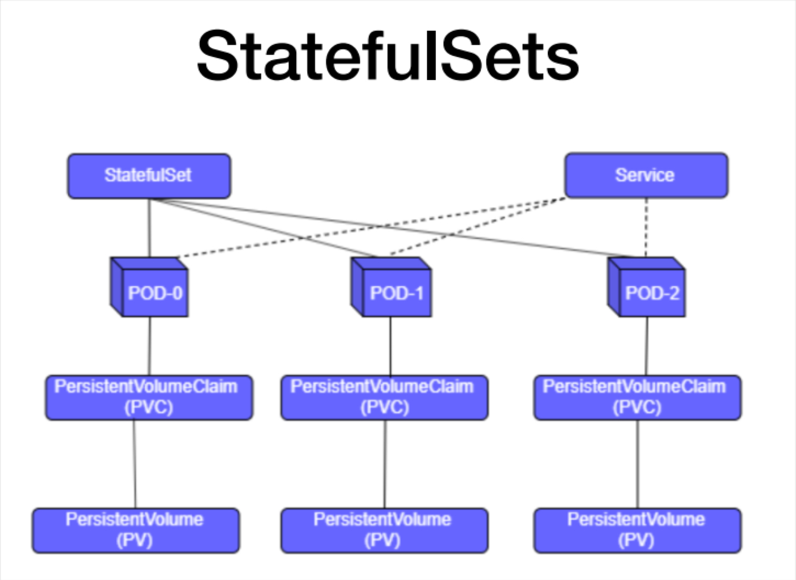

# StatefulSets

- Does not create ReplicaSet, generates Pods directly.
- Each replica of the pod will have its own volume, and each one will create its own PVC (PersistentVolumeClaim).
- They scale in order, first POD-1, then POD-2 and so on.
- Pod's Ordinal Index (Scale from 0 to + and descale from + to 0)
- Each POD has a type of service underneath, they have a name with which each pod can be reached, so that queries can be made between them.



## Stateful vs Stateless

- Stateless app:
  - Depends on no persistent storage.
  - Apps with a single function or service, examples: web, print, cdn, etc.
- Stateful app:
  - Requires persistent storage.
  - Has several other parameters which it is supposed to look after in cluster.
  - Examples: databases, transaction solutions, such as home banking, mail servers.

1. Check persistent volumes:

    ```console
    kubectl get pv
    ```

2. Create file statefulset.yaml

    ```console
    nano statefulset.yaml
    ```

    ```yaml
    kind: Service
    apiVersion: v1
    metadata:
     name: nginx
     labels:
       app: nginx
    spec:
     ports:
     - port: 80
       name: web
     clusterIP: None
     selector:
       app: nginx
    ---
    apiVersion: apps/v1
    kind: StatefulSet
    metadata:
     name: web
    spec:
     serviceName: "nginx"
     replicas: 2
     selector:
       matchLabels:
         app: nginx
     template:
       metadata:
         labels:
           app: nginx
       spec:
         containers:
         - name: nginx
           image: k8s.gcr.io/nginx-slim:0.8
           ports:
           - containerPort: 80
             name: web
           volumeMounts:
           - name: www
             mountPath: /usr/share/nginx/html
     volumeClaimTemplates:
     - metadata:
         name: www
       spec:
         accessModes: [ "ReadWriteOnce" ]
         resources:
           requests:
             storage: 10Mi
    ```

3. Execute

    ```console
    kubectl apply -f statefulset.yaml
    kubectl get statefulset
    kubectl get sts
    kubectl get pods,pvc,pv
    ```

4. Check svc

    ```console
    kubectl get svc
    kubectl describe svc nginx
    ```

5. Tests Pods names:

    ```console
    kubectl delete pods web-1
    kubectl get pods
    kubectl delete pods web-0
    kubectl get pods
    ```

6. Test hostname:

    ```console
    for i in 0 1; do kubectl exec web-$i -- sh -c 'hostname'; done
    ```

7. Tests DNS:

    ```console
    kubectl run -i --tty --image busybox:1.28 dns-test --restart=Never --rm /bin/sh
    nslookup web-0.nginx
    nslookup web-1.nginx
    exit
    kubectl describe pod web-1 |grep IP
    kubectl describe pod web-0 |grep IP
    ```

8. Test storage:

    ```console
    for i in 0 1; do kubectl exec web-$i -- sh -c 'echo $(hostname) > /usr/share/nginx/   html/index.html'; done
    for i in 0 1; do kubectl exec -it web-$i -- curl localhost; done
    kubectl delete pod -l app=nginx
    ```

9. In another terminal see the changes:

    ```console
    watch kubectl get pods #Observar que no se generan nuevos pods hasta que se terminen porque son de nombres unicos.
    ```

10. Test again if the changes persist:

    ```console
    for i in 0 1; do kubectl exec -it web-$i -- curl localhost; done
    kubectl exec -ti web-0 -- bash
    cat /usr/share/nginx/html/index.html
    hostname
    exit
    ```

11. Testing sts scaling:

    ```console
    kubectl scale sts web --replicas=5
    kubectl get sts
    kubectl get pods
    for i in 0 1 2 3 4; do kubectl exec -it web-$i -- curl localhost; done #Debe salir    404 para los 3 nuevos pods.
    ```

12. Inspecting errors:

    ```console
    kubectl describe pods web-2
    kubectl get pvc
    kubectl describe pvc www-web-2
    kubectl get pv #Revisando pv y pvc:
    kubectl get pvc
    kubectl scale sts web --replicas=2 #Down scaling:
    kubectl get pv #Revisando pv y pvc:
    kubectl get pvc
    ```

13. Tip: Recover manifest pod:

    ```console
    kubectl get pod web-2 -o yaml
    ```
