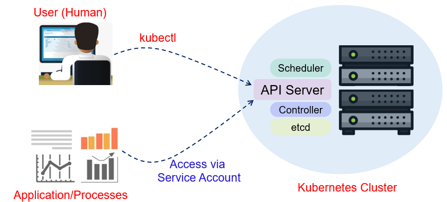

# Service Account



- When a process running inside a container needs to make a request to Kubernetes’ API Server, a Service Account is used.
- These objects are defined by per namespace.
- Every pod in your k8s cluster has a Service Account it uses. Most of time, this is set to “default”.

    ```console
    kubectl get serviceaccount
    kubectl get serviceaccount -A
    kubectl get serviceaccount --all-namespaces | grep default
    ```

## Probando desde Pod

1. Create file pod-default.yaml

    ```console
    nano pod-default.yaml
    ```

    ```yaml
    apiVersion: v1
    kind: Pod
    metadata:
     name: pod-default
    spec:
     containers:
     - name: alpine
       image: alpine:3.9
       command:
       - "sleep"
       - "10000"
    ```

    ```console
    kubectl apply -f pod-default.yaml
    kubectl get pods
    kubectl get svc
    NAME         TYPE        CLUSTER-IP   EXTERNAL-IP   PORT(S)   AGE
    kubernetes   ClusterIP   10.96.0.1    <none>        443/TCP   29m
    ```

2. Check your service account.

    ```console
    kubectl describe pod pod-default | grep -i "account"
    /var/run/secrets/kubernetes.io/serviceaccount from default-token-tmqxh (ro)
    kubectl exec -ti pod-default -- sh
    ls -la /var/run/secrets/kubernetes.io/serviceaccount/
    cat /var/run/secrets/kubernetes.io/serviceaccount/namespace
    ```

3. Asking the kubernetes service:

    ```console
    apk add --update curl
    curl https://kubernetes/api/v1 --insecure #Debe salir error por ser usuario anonimo.
    ```

4. Obtaining token from the default service account:

    ```console
    TOKEN=$(cat /var/run/secrets/kubernetes.io/serviceaccount/token)
    curl -H "Authorization: Bearer $TOKEN" https://kubernetes/api/v1/ --insecure #Debe funcionar sin problemas y listar.
    curl -H "Authorization: Bearer $TOKEN" https://kubernetes/api/v1/namespaces/default/pods/ --insecure #Debe salir error porque el service account default no tiene permisos de listar Pods.
    exit
    ```

## Create your own Service Account with Roles and Roles Binding

1. Create file service-account.yaml

    ```console
    nano service-account.yaml
    ```

    ```yaml
    kind: ServiceAccount
    apiVersion: v1
    metadata:
     name: demo-sa
    ```

    ```console
    kubectl apply -f service-account.yaml
    kubectl get sa
    ```

2. Create file archivo role.yaml

    ```console
    nano role.yaml
    ```

    ```yaml
    kind: Role
    # apiVersion: rbac.authorization.k8s.io/v1beta1
    apiVersion: rbac.authorization.k8s.io/v1
    metadata:
      name: list-pods
      namespace: default
    rules:
      - apiGroups:
        - ''
        resources:
        - pods
        verbs:
        - list
    ```

    ```console
    kubectl apply -f role.yaml
    kubectl get role
    ```

3. Create file role-binding.yaml

    ```console
    nano role-binding.yaml
    ```

    ```yaml
    kind: RoleBinding
    # apiVersion: rbac.authorization.k8s.io/v1beta1
    apiVersion: rbac.authorization.k8s.io/v1
    metadata:
      name: list-pods_demo-sa
      namespace: default
    subjects:
    - kind: ServiceAccount
      name: demo-sa
      namespace: default
    roleRef:
      kind: Role
      name: list-pods
      apiGroup: rbac.authorization.k8s.io
    ```

4. Execute

    ```console
    kubectl apply -f role-binding.yaml
    kubectl get role,sa,rolebinding
    ```

5. Create file pod-sa.yaml

    ```console
    nano pod-sa.yaml
    ```

    ```yaml
    kind: Pod
    apiVersion: v1
    metadata:
      name: pod-demo-sa
    spec:
      serviceAccountName: demo-sa
      containers:
      - name: alpine
        image: alpine:3.9
        command:
        - "sleep"
        - "10000"
    ```

    ```console
    kubectl apply -f pod-sa.yaml
    kubectl get pods
    ```

6. Verify that you use the service account demo-sa

    ```console
    kubectl describe pods pod-demo-sa | grep -i "account"
    kubectl exec -ti pod-demo-sa -- sh
    ls -la /var/run/secrets/kubernetes.io/serviceaccount/
    cat /var/run/secrets/kubernetes.io/serviceaccount/namespace
    ```

7. Asking the kubernetes service:

    ```console
    apk add --update curl
    curl https://kubernetes/api/v1 --insecure #Debe salir error por ser usuario anonimo.
    ```

8. Obtaining token from the default service account:

    ```console
    TOKEN=$(cat /var/run/secrets/kubernetes.io/serviceaccount/token)
    curl -H "Authorization: Bearer $TOKEN" https://kubernetes/api/v1/ --insecure
    curl -H "Authorization: Bearer $TOKEN" https://kubernetes/api/v1/namespaces/default/pods/ --insecure #En ambos casos debe funcionar sin problemas y listar correctamente.
    ```

9. Trying to list services:

    ```console
    curl -H "Authorization: Bearer $TOKEN" https://kubernetes/api/v1/namespaces/default/services/ --insecure #Debe salir error porque el role es solo para listar pods no services.
    ```
